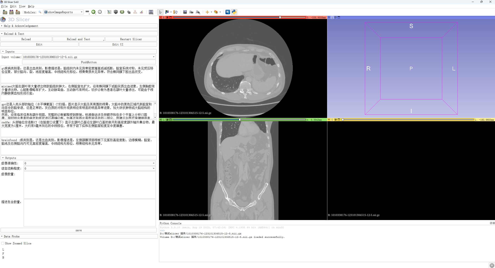

# Image Report Rating Plugin for 3D Slicer

## Overview

This 3D Slicer plugin is designed to assist in reading images and corresponding reports, and providing options to rate the reports within the 3D Slicer platform.

## Features

Load medical images directly into 3D Slicer
Display associated reports side by side with the images
Ability to provide ratings and feedback on the reports
User-friendly interface for easy navigation and interaction

Longkey G (gingerbread000@163.com)License

This plugin is released under the MIT License
